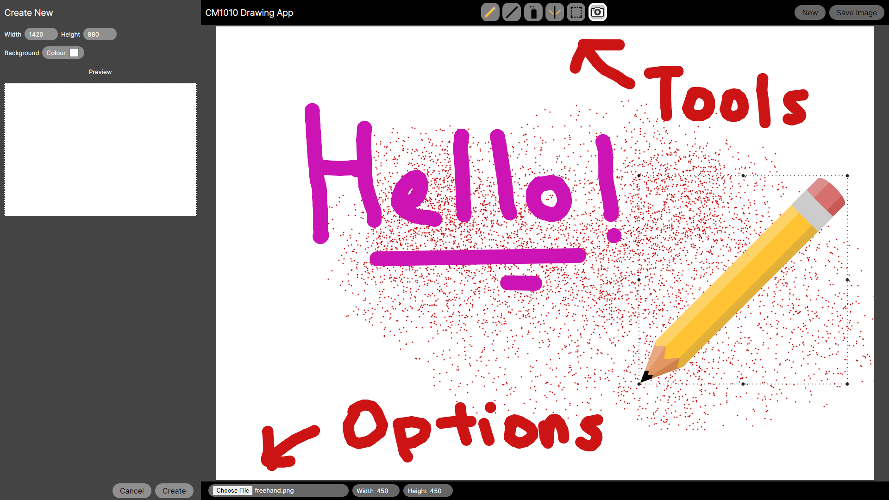
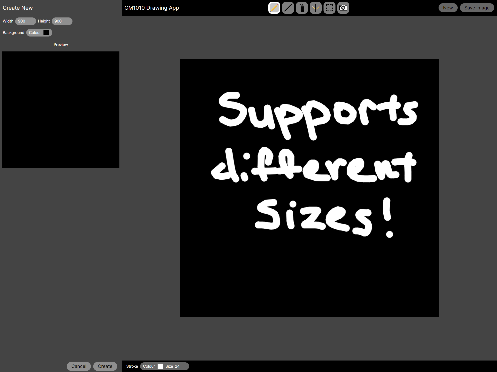

  

  <h3 align="center">CM1010 Drawing App</h3>

  

    CM1010 Introduction to Computer Programming II
  

# About The Project
Project assigned by SIM GE - UOL for the purpose of CM1010 Introduction to Computer Programming II

## Built With

## Screenshots

<a href="#top">back to top</a>

# Usage
To start, open the `index.html` file using a Live Server extension.

Alternatively, visit this website hosted by [Vercel](https://vercel.com/): [CM1010 Drawing App](https://cm1010-drawing-app.vercel.app/)

<a href="#top">back to top</a>

# Features
- [x] Original Code Restructuring
- [x] Helper Functions
- [x] Redesign GUI
- [x] New Tool: Select Tool
- [x] New Tool: Image Tool
- [x] New Tool: Stamp Tool (Coursera)
- [x] Update Old Tools
- [x] Preset Canvas Size

<a href="#top">back to top</a>

# Acknowledgments 

## External Sources Utilized
* p5.js Library from [p5.js](https://p5js.org/)
* Tool Icons from [freeiconspng.com](freeiconspng.com)
* Stamp Tool Icon from [uxwing](https://uxwing.com/stamp-icon/)
* Code by [squishynotions](https://editor.p5js.org/squishynotions/sketches) from [p5.js Web Editor](https://editor.p5js.org/squishynotions/sketches/Ax195WTdz)

## Tools Utilized
* 
* 
* 
* 
* 

<a href="#top">back to top</a>
